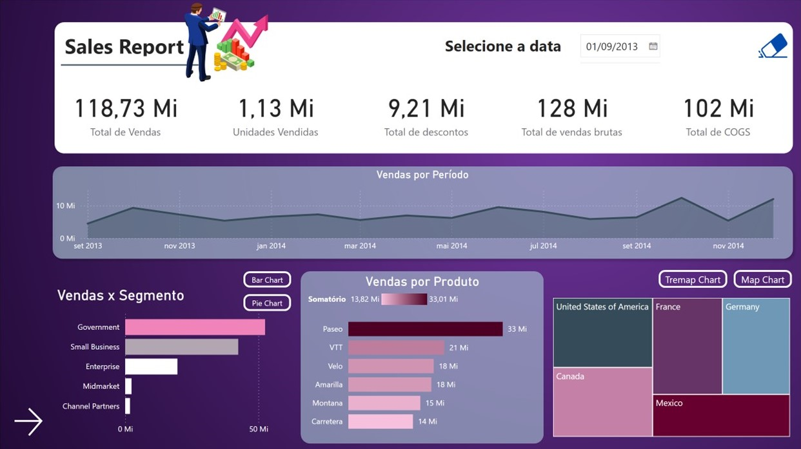
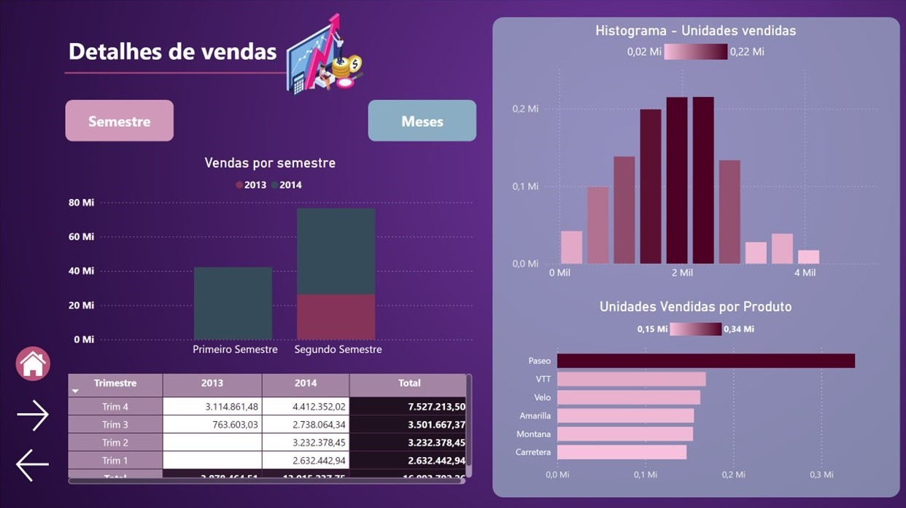

<h1>Criando um Relatório Vendas e Lucros com Data Analytics com Power BI</h1>

<h3>Repositório criado para o desafio do bootcamp NTT DATA - Engenharia de Dados com Python</h3>

<h4 align="justify">Descrição do projeto</h4>

    Este repositório contém o projeto que desenvolvi para o desafio final do bootcamp, focado em criar um relatório de vendas e lucros utilizando Power BI. O objetivo foi entregar uma análise abrangente e interativa, segmentada por diferentes produtos, segmentos de mercado e períodos de tempo, com foco em insights estratégicos.

<h5 align="justify">Pontos considerados:</h5>

    <ul>
        <li>Página de Detalhes: Segui as orientações do desafio para criar a página de detalhes, garantindo que ela apresentasse informações essenciais de forma objetiva.
        <li>Disposição dos Visuais: Pensei na disposição dos visuais priorizando a experiência do cliente, organizando-os para facilitar a compreensão e o consumo do conteúdo.
        <li>Desenvolvi medidas DAX personalizadas para calcular KPIs relevantes e entregar análises precisas para o negócio.
    </ul>

    Este projeto reflete minha experiência em Data Analytics, focando em boas práticas de visualização e análise, com o objetivo de proporcionar insights valiosos para a tomada de decisão.

<h4 align="justify">Estrutura do relatório</h4>

    O relatório é composto por seis páginas, cada uma abordando aspectos específicos das vendas e lucros:

    <h5><b>1. Home Page</b></h5>
           <ul><li>Página inicial com o título do relatório e um botão para explorar a análise.</ul>
    

   <h5><b>2. Principal (Relatório de Vendas)</b></h5>
      <b>Cards:</b>
      <ul>
        <li>Total de vendas
        <li>Unidades vendidas
        <li>Total de vendas brutas
        <li>Total de COGS (Custo das Mercadorias Vendidas)
      </ul>
      <b>Gráficos:</b>
      <ul>
            <li>Vendas por período
            <li>Vendas por segmento (barras e pizza)
            <li>Vendas por produto
      </ul>
      <b>Mapas:</b>
        <ul>
          <li>Mapa de árvore e mapa de calor com vendas por país
        </ul>
    
    <h5><b>3. Detalhes de Vendas</b></h5>
      <b>Gráficos com:</b>
      <ul>
        <li>Vendas por semestre e por mês
        <li>Histograma de unidades vendidas
        <li>Unidades vendidas por produto
      </ul>
    
    <h5><b>4. TOPN e Outlierss</b></h5>
      <b>Outliers e análises:</b>
      <ul>
        <li>Vendas totais por produto
        <li>Vendas, unidades e lucro por produto e mês
      </ul>
      <b>Gráficos:</b>
      <ul>
        <li>Total de vendas e top 3 produtos por país
        <li>Top 3 produtos por categoria
      </ul>
    
    <h5><b>5. Data Analytics</b></h5>
      <b>Gráficos temporais e de barras:</b>
      <ul>
        <li>Top 5 meses com maior lucro e volume de vendas
      </ul>
      <b>Cards e gráficos:</b>
      <ul>
        <li>Máximo de vendas por segmento
        <li>Top 3 países com maior volume de vendas
      </ul>
    
    <h5><b>6. Categorias e Clusters</b></h5>
      <b>Gráfico de dispersão:</b>
      <ul>
        <li>Unidades vendidas e vendas por lucro (clusters)
      </ul>
      <b>Gráficos de barras:</b>
      <ul>
        <li>Total de vendas por países e continentes
        <li>Vendas por mês e por semestre
        <li>Vendas por segmento agrupado
      </ul>
    

<h4 align="justify">Tecnologias Utilizadas</h4>

    <ul>
        <li>Power BI: Utilizei esta ferramenta para criar relatórios interativos e dashboards.
        <li>Excel: Utilizei arquivos Excel como fonte de dados ou para organizar informações prévias.
        <li>Git/GitHub: Gerenciei o controle de versão do projeto e disponibilizei os arquivos neste repositório.
    </ul>

 

<h4 align="justify">Como executar</h4>

    Para visualizar o relatório final:
    <ol>
        <li>Faça o download do arquivo <code>.pbix</code> disponível neste repositório.
        <li>Abra o arquivo no Power BI Desktop.
        <li>Navegue entre as páginas utilizando os botões interativos e explore as melhorias de design e usabilidade.
    </ol>

<h4 align="justify">Conclusão</h4>

    Este projeto não se limita a apresentar dados financeiros, mas também busca proporcionar uma experiência interativa e agradável para o usuário final, aplicando boas práticas de design e navegabilidade. A organização cuidadosa e as interações visuais visam facilitar a tomada de decisões estratégicas de forma prática e eficiente.

